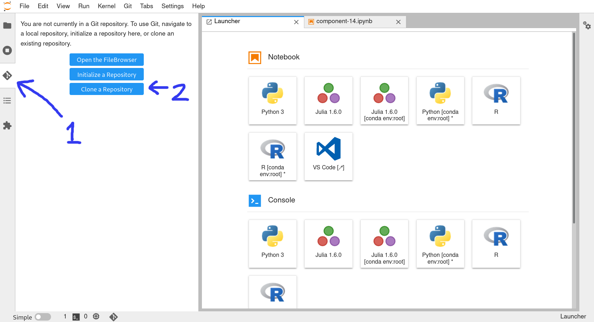
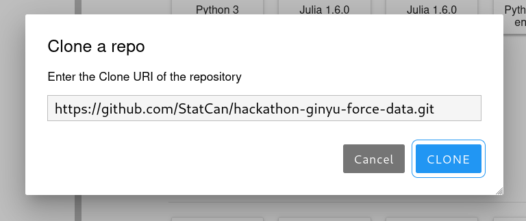
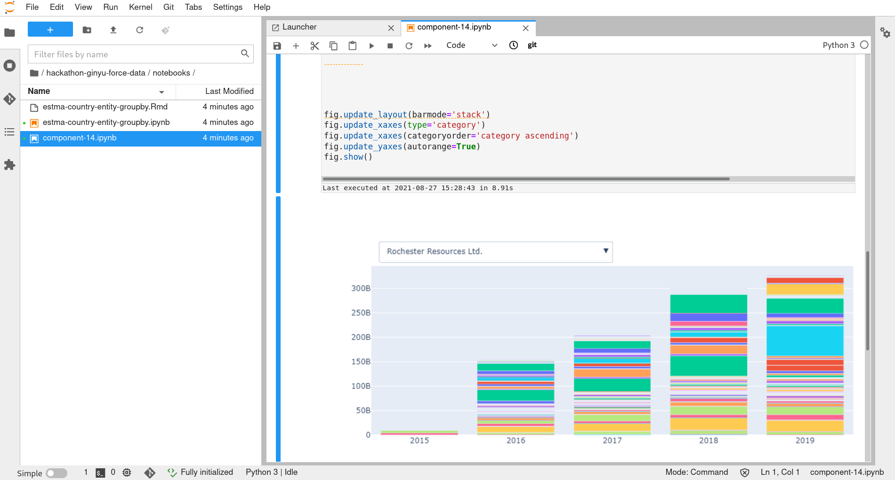
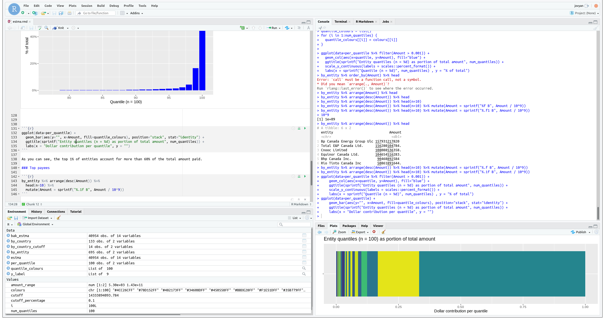

# Running these Notebooks on AAW

To run these notebooks in your Advanced Analystics Workspace evironment, you
just need to clone this repository in your notebook server.

## JupyterLab

1. Click the Git tab in the left menu
2. Select **Clone a Repository**
3. Enter the clone URL of this repository:
   `https://github.com/StatCan/hackathon-ginyu-force-data.git`

After Git clones the repository, you'll see a new `/hackathon-ginyu-force-data`
folder in your file browser. Navigate into its `notebooks` directory to find your
`.ipynb` notebooks waiting for you.

You can start running and editing right away!

## RStudio

If you prefer running RMarkdown notebooks using RStudio, then that's easy too!

1. Select **File > New Project... > Version Control > Git**
2. Under **Repository URL**, enter the clone URL of this repository:
   `https://github.com/StatCan/hackathon-ginyu-force-data.git`
3. Choose a folder for your project

After Git clones the repository, you can navigate into your project's `notebooks`
directory to find your `.Rmd` notebooks waiting for you.

Enjoy!

